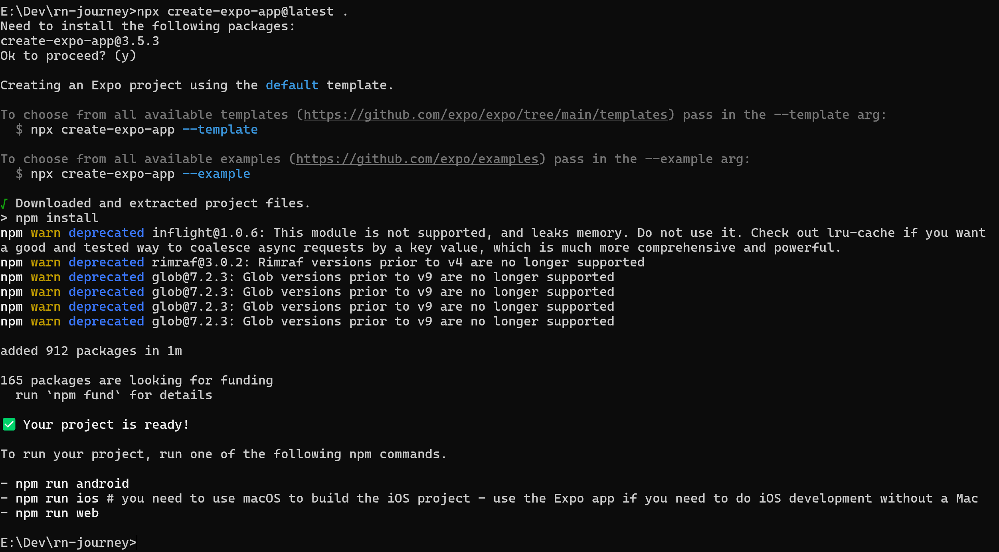

## 🚀 Chapter 1: Windows 环境开发注意事项

### 1. 项目路径配置规范 (Project Path Configuration)

在 Windows 系统下进行 React Native 开发时，必须严格遵守“路径极简原则”。

**✅ 推荐做法：**
将项目直接放置在盘符根目录或二级目录下，且目录名仅使用英文、数字和连字符。

* `D:\Dev\react-native-learning-journey`
* `C:\Code\rn-project`

**❌ 严禁做法：**

* 放在桌面或用户文档目录：`C:\Users\Huajiang\Desktop\My Projects\...`
* 路径包含空格：`D:\My Projects\React Native App`
* 路径包含中文：`D:\代码\我的项目`

### 2. 核心原因解析 (Why?)

#### A. Windows MAX_PATH 限制 (260字符)

尽管现代 Windows (win10/11) 允许通过注册表解除路径长度限制，但 React Native 依赖的工具链（特别是 Android 构建工具）仍然受限：

* **Gradle 构建过程**：Android 编译时，Gradle 会在 `build` 目录下生成大量嵌套极深的中间文件（Intermediate files）。
* **npm/yarn 依赖树**：前端项目的 `node_modules` 本身具有深层嵌套特性。

当 **"项目基础路径" + "node_modules嵌套" + "Gradle构建产物"** 叠加时，极易突破 260 字符限制，导致编译直接报错（通常报 `File not found` 或 `AAPT2 error`），且此类错误极难排查。

#### B. 工具链兼容性 (Toolchain Compatibility)

* **Metro Bundler**：RN 的打包工具在处理包含空格或特殊字符（如中文）的路径时，文件监听（Watchman）和模块解析可能会失效。
* **NDK & CMake**：如果你未来涉及到 C++ 原生模块开发，许多底层构建脚本对空格路径的支持几乎为零。

---

## 🚀 Chapter 2: 项目初始化

### 1. Expo 项目创建指令 (Project Creation)

根据当前目录结构的不同，有两种初始化方式：

#### 场景 A：已手动创建并进入文件夹（推荐）

如果你已经根据 Windows 规范建好了文件夹（如 `E:\Dev\rn-journey`）并位于该目录下：

```bash
# 注意命令最后的点 "."，代表在当前目录展开
npx create-expo-app@latest .
```

#### 场景 B：尚未创建文件夹

如果你还在根目录（如 `E:\Dev`），希望 CLI 自动创建文件夹：

```bash
# 这将自动创建一个名为 rn-journey 的新文件夹
npx create-expo-app@latest rn-journey
```

### 2. 依赖警告解析 (Dependency Warnings)

在创建项目过程中，控制台可能会输出大量 `npm warn deprecated` 警告（如 `inflight`, `rimraf`, `glob` 等）。

**现象截图：**



**核心原因：**

* **间接依赖 (Transitive Dependencies)**：这些过时的包通常不是项目直接使用的，而是底层工具链（如 Metro Bundler, Jest 等）所依赖的深层库。
* **版本锁定 (Version Locking)**：React Native 和 Expo 为了保证跨平台构建的稳定性，严格锁定了依赖树的版本。上游工具库可能尚未更新对这些底层包的引用。

**处理原则：**

1. **忽略警告**：只要最终显示 `Your project is ready!` 且没有 `ERR!` 报错，即可视为安装成功。
2. **❌ 禁止盲目修复**：**千万不要** 随意运行 `npm audit fix`。在 React Native 项目中，强制升级依赖版本极大概率会导致 Metro 打包器与原生运行时不兼容，导致项目无法启动。

---

## 🚀 Chapter 3: Expo 项目启动指南

### 1. 环境说明

- **开发环境**：Windows 系统
- **预览设备**：iOS 手机
- **启动方式**：Metro Bundler + Expo Go

---

### 2. 启动步骤

#### 启动开发服务器

在项目根目录执行：

```bash
npm run start
# 或
npm start
# 或
npx expo start
```

---

### 3. 常见问题与解决方案

#### ❌ 问题 1：代理配置错误

##### 错误信息

```bash
E:\Dev\rn-journey>npm run start

> rn-journey@1.0.0 start
> expo start

Starting project at E:\Dev\rn-journey
React Compiler enabled
Starting Metro Bundler
TypeError: Invalid URL
TypeError: Invalid URL
    at new URL (node:internal/url:816:29)
    at ProxyAgent.#getUrl (E:\Dev\rn-journey\node_modules\undici\lib\dispatcher\proxy-agent.js:222:14)
    at new ProxyAgent (E:\Dev\rn-journey\node_modules\undici\lib\dispatcher\proxy-agent.js:108:29)
    at new EnvHttpProxyAgent (E:\Dev\rn-journey\node_modules\undici\lib\dispatcher\env-http-proxy-agent.js:37:31)
    at fetchFunction (E:\Dev\rn-journey\node_modules\expo\node_modules\@expo\cli\src\api\rest\wrapFetchWithProxy.ts:14:28)
    ...
```

##### 问题原因

Windows 系统环境变量中存在**无效的代理配置**（`HTTP_PROXY`、`HTTPS_PROXY` 等），导致 Expo CLI 在尝试访问网络时解析 URL 失败。

常见原因：

- 科学上网工具设置了全局代理但未正确配置
- 公司 VPN 残留的代理设置
- 代理变量值为空字符串或格式错误

##### 解决方案

**方法 1：临时清除代理（推荐）**

在启动项目前，先执行以下命令清除当前会话的代理设置：

```bash
set HTTP_PROXY=
set HTTPS_PROXY=
set ALL_PROXY=
npm start
```

**方法 2：永久删除系统代理**

1. 按 `Win + R`，输入 `sysdm.cpl`，回车
2. 点击 **"高级"** → **"环境变量"**
3. 在 **"用户变量"** 和 **"系统变量"** 中查找并删除：
   - `HTTP_PROXY`
   - `HTTPS_PROXY`
   - `ALL_PROXY`
4. 重启终端后再运行 `npm start`

**方法 3：配置正确的代理（如果确实需要代理）**

如果你的网络环境必须使用代理，需要设置正确的格式：

```bash
set HTTP_PROXY=http://127.0.0.1:7890
set HTTPS_PROXY=http://127.0.0.1:7890
npm start
```

> ⚠️ 注意：端口号需要改成你实际代理软件的端口（常见：7890、1080、10809）

---

#### ✅ 成功启动后的界面

执行清除代理命令后再次运行 `npm start`，会看到：

```
React Compiler enabled
Starting Metro Bundler

█▀▀▀▀▀▀▀▀▀▀▀▀▀▀▀▀▀▀▀▀▀▀▀▀▀▀▀▀█
█  QR Code (二维码)          █
█▄▄▄▄▄▄▄▄▄▄▄▄▄▄▄▄▄▄▄▄▄▄▄▄▄▄█

› Metro waiting on exp://192.168.124.5:8081
› Scan the QR code above with Expo Go (Android) or the Camera app (iOS)

› Web is waiting on http://localhost:8081

› Using Expo Go
› Press s | switch to development build

› Press a | open Android
› Press w | open web

› Press j | open debugger
› Press r | reload app
› Press m | toggle menu
› shift+m | more tools
› Press o | open project code in your editor

› Press ? | show all commands

Logs for your project will appear below. Press Ctrl+C to exit.
```

---

### 4. 在 iOS 设备上预览

#### 前置条件

1. ✅ 手机和电脑连接**同一 WiFi 网络**
2. ✅ 手机已安装 **Expo Go** App（App Store 搜索下载）

#### 预览步骤

##### ⚠️ 重要提示：iOS 系统的特殊性

**iOS 版 Expo Go 没有内置扫码功能**，需要使用系统原生相机扫码。

##### 正确操作流程

1. **不要打开 Expo Go App**
2. 打开 iPhone 自带的 **相机 App**
3. 对准电脑终端显示的二维码
4. 屏幕顶部会弹出通知：**"在 Expo Go 中打开"**
5. 点击通知，系统会自动启动 Expo Go 并加载项目

##### 常见误区

❌ **错误做法**：直接打开 Expo Go，在 App 内找扫码按钮

- iOS 版 Expo Go 界面只显示 "Select the local server when it appears here"
- 底部列表为空，没有扫码入口

✅ **正确做法**：使用系统相机扫码 → 点击通知 → 自动跳转

---

#### 其他预览方式

##### 方式 1：浏览器预览（快速测试）

在终端按 `w` 键，或在浏览器打开：

```
http://localhost:8081
```

**优点**：无需配置，立即可见
**缺点**：无法使用原生功能（相机、传感器等）

##### 方式 2：Android 模拟器（需提前配置）

在终端按 `a` 键

**前置条件**：

- 已安装 Android Studio
- 已创建并启动 Android 虚拟设备（AVD）

---

### 5. 快捷键说明

| 按键         | 功能                    |
| ------------ | ----------------------- |
| `w`        | 在浏览器中打开          |
| `a`        | 在 Android 模拟器中打开 |
| `r`        | 重新加载应用            |
| `j`        | 打开开发者调试工具      |
| `m`        | 切换开发菜单            |
| `o`        | 在编辑器中打开项目      |
| `Ctrl + C` | 停止开发服务器          |

---

### 6. 注意事项

1. **开发服务器必须保持运行**终端窗口不能关闭，关闭后 Metro Bundler 会停止，手机无法连接
2. **无需 Expo 账号**开发阶段扫码预览不需要登录账号，直接扫码即可使用
3. **热更新功能**修改代码后保存，手机上的 App 会自动刷新显示最新内容
4. **首次加载较慢**
   第一次启动时 Metro Bundler 需要打包所有资源，等待 1-2 分钟是正常的

---

## 🚀 Chapter 4: 项目重置

### 1. 重置命令说明

当需要快速开始新的项目开发时，可以使用项目内置的重置命令来清理现有代码，创建一个全新的开发起点。

#### 执行命令

```bash
npm run reset-project
```

---

### 2. 重置过程详解

#### 交互式确认

执行命令后，脚本会询问是否保留现有文件：

```bash
Do you want to move existing files to /app-example instead of deleting them? (Y/n):
```

**选项说明：**

- **输入 `Y` 或直接回车**：将现有文件移动到 `app-example` 目录（保留备份）
- **输入 `n`**：直接删除现有文件（不保留备份）

#### 删除/移动的目录

重置脚本会处理以下目录：

- `/app` - 应用主目录
- `/components` - 组件目录
- `/hooks` - 自定义 Hooks 目录
- `/constants` - 常量定义目录
- `/scripts` - 脚本目录（包括重置脚本本身）

#### 创建的新结构

重置完成后，会创建以下基础文件：

```
📁 /app
  📄 index.tsx      - 主入口文件
  📄 _layout.tsx    - 路由布局文件
```

---

### 3. 重置后的操作步骤

重置完成后，终端会显示下一步操作提示：

```
✅ Project reset complete. Next steps:
1. Run `npx expo start` to start a development server.
2. Edit app/index.tsx to edit the main screen.
```

#### 快速开始

1. **启动开发服务器**

   ```bash
   npx expo start
   ```
2. **编辑主界面**

   打开 `app/index.tsx` 开始编写你的应用代码


#### 注意事项

⚠️ **重要提醒：**

1. **重置前请确保重要代码已提交到 Git**

   - 重置操作会删除或移动文件，未提交的代码可能丢失
   - 建议在执行重置前先运行 `git status` 检查变更
2. **选择保留备份（推荐）**

   - 如果选择 `Y`，现有代码会移动到 `app-example` 目录
   - 可以在需要时参考之前的实现
3. **重置脚本本身也会被删除**

   - 如果选择 `n`（不保留），`scripts/reset-project.js` 也会被删除
   - 但 `package.json` 中的脚本命令仍然存在，只是无法执行
   - 需要重新创建脚本文件才能再次使用重置功能

### 4. 重置后的项目结构

重置完成后，项目结构如下：

```
rn-journey/
├── app/
│   ├── index.tsx      # 主入口文件
│   └── _layout.tsx    # 路由布局文件
├── node_modules/      # 依赖包（保持不变）
├── package.json       # 项目配置（保持不变）
├── app.json          # Expo 配置（保持不变）
└── ...其他配置文件（保持不变）
```
